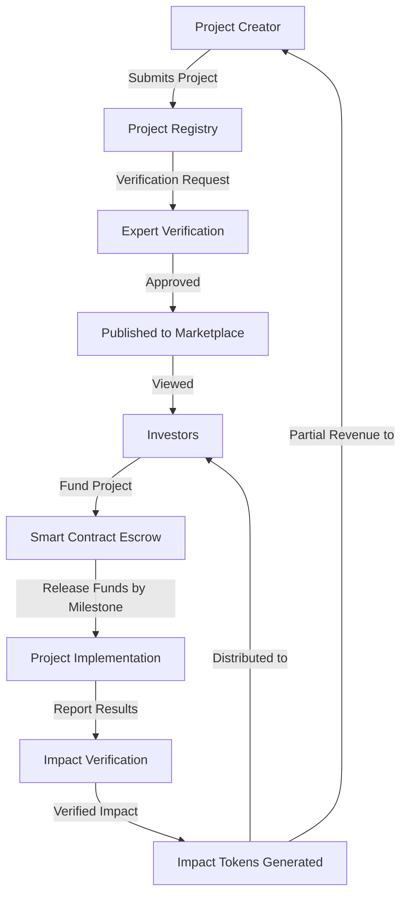
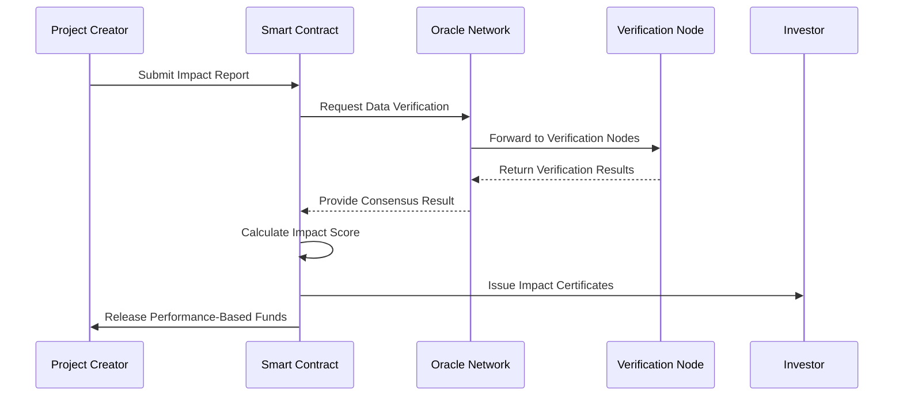
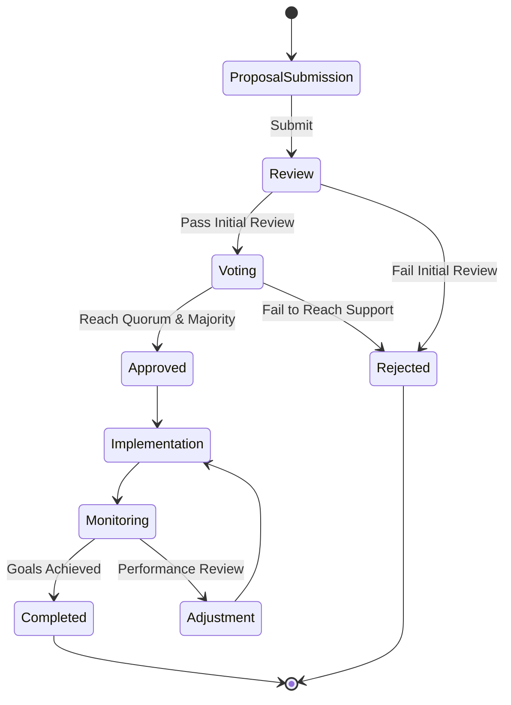

# AMOCA: Alliance Modeling Of Climate Action Finance

**Harnessing the Sui ecosystem to revolutionize climate finance and accelerate global sustainability.**

Climate change demands urgent action, but financial barriers often impede progress. AMOCA bridges this gap by creating a decentralized alliance where capital meets innovation. Built on the Sui blockchain, our platform transforms how climate initiatives are funded, tracked, and scaled.

AMOCA (Alliance Modeling Of Climate Action Finance) unites governments, international organizations, private investors, and climate innovators in a transparent ecosystem powered by Web3 technology. Our platform enables:

- **Data-Driven Decision Making**: Advanced modeling of climate initiatives from renewable energy to sustainable agriculture, providing clear insights into project feasibility and impact metrics
- **Decentralized Funding Mechanisms**: Streamlined investment flows with verifiable accountability through Sui's powerful object model
- **Global Accessibility**: Democratized access to climate financing for developing nations and grassroots innovators
- **Transparent Impact Tracking**: Real-time monitoring of project outcomes with blockchain-verified reporting

By leveraging Sui's secure, scalable infrastructure, AMOCA transforms climate action from aspiration to implementation—creating a financially sustainable path toward a climate-resilient future.

## 🚀 Sui Overflow Hackathon Submission

This project is our submission for the Sui Overflow Hackathon. We've built a decentralized application on the Sui blockchain to revolutionize climate finance through transparent, efficient, and collaborative solutions.

## 💡 Key Features

- **Climate Project Marketplace**: Browse, submit, and fund climate action projects
- **Impact Tokenization**: Convert climate impact into tradable assets using Sui's object model
- **DAO Governance**: Decentralized decision-making for project approvals and fund allocation
- **Multi-party Escrow System**: Secure and transparent funding mechanisms
- **Impact Verification Oracles**: Integration with real-world data sources for verification
- **Cross-chain Interoperability**: Bridge with Solana for expanded liquidity options

## 📊 Workflow Diagrams

### Project Submission and Funding Flow



### Impact Verification Process



### DAO Governance Framework



## 🛠️ Technology Stack

- **Blockchain**: Sui Move for smart contracts
- **Frontend**: React with TypeScript
- **Backend**: Sui RPC nodes and custom API services
- **Data Storage**: On-chain state and IPFS for larger documents
- **Analytics**: TensorFlow models for climate impact prediction

## 📋 Smart Contract Architecture

Our Move contracts implement:

- Project Registry with ownership and funding tracking
- Token standards for impact certification
- Multi-signature approval workflows
- DAO voting mechanisms
- Oracle integration frameworks

## 🏁 Getting Started

### Prerequisites

- Sui CLI and SDK
- Node.js (v23+)
- pnpm

### Installation

```bash
# Clone the repository
git clone https://github.com/manolaz/amoca-sui-overflow.git
cd amoca-sui-overflow

# Install dependencies
pnpm install

# Configure environment
cp .env.example .env
# Edit .env with your configuration

# Build Move modules
sui move build

# Start the application
pnpm start
```

## 🔄 Usage Flow

1. **Project Submission**: Climate initiatives submit project details, funding requirements, and impact metrics
2. **Verification**: Experts and oracles verify project feasibility and impact calculations
3. **Funding**: Investors browse projects and allocate funds through smart contracts
4. **Execution & Monitoring**: Track progress and milestone completion on-chain
5. **Impact Certification**: Generate and distribute impact tokens upon verified outcomes

## 🔮 Future Roadmap

- Advanced impact simulation models
- Integration with carbon credit marketplaces
- Mobile application for field reporting
- Expanded oracle networks for diversified verification

## 👥 Team

- [Tristan] - Smart Contract Developer
- [Tristan] - Frontend Engineer
- [Tristan] - Climate Finance Expert
- [Tristan] - Project Manager

## 🏆 Hackathon Experience

Building AMOCA during the Sui Overflow Hackathon has been an incredible journey. We encountered challenges particularly in designing the optimal object model for our climate projects and implementing secure multi-party funding mechanisms. The Sui framework's unique approach to object ownership helped us create innovative solutions for tracking project ownership and funding lifecycles.

## 📄 License

This project is licensed under the MIT License - see the LICENSE file for details.

## 🤝 Contributing

We welcome contributions! Please see CONTRIBUTING.md for details on how to get started.
